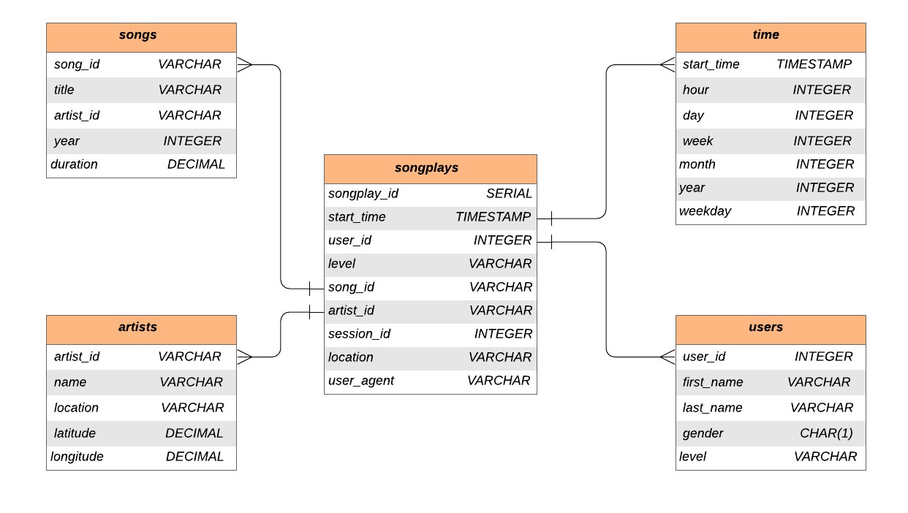
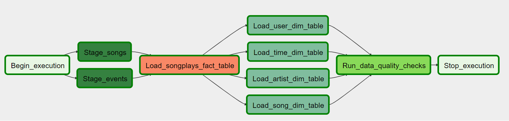
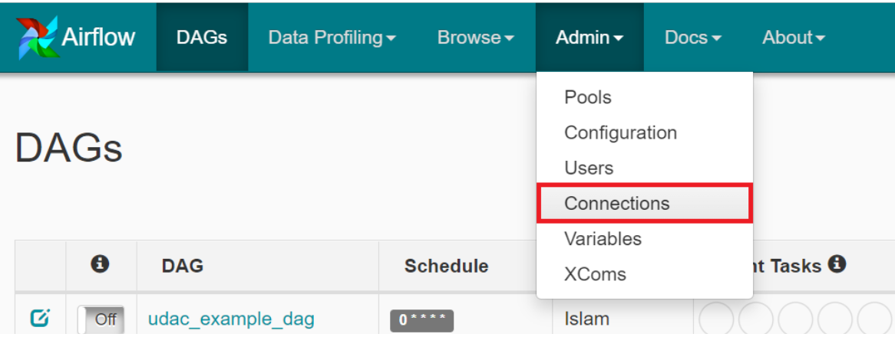
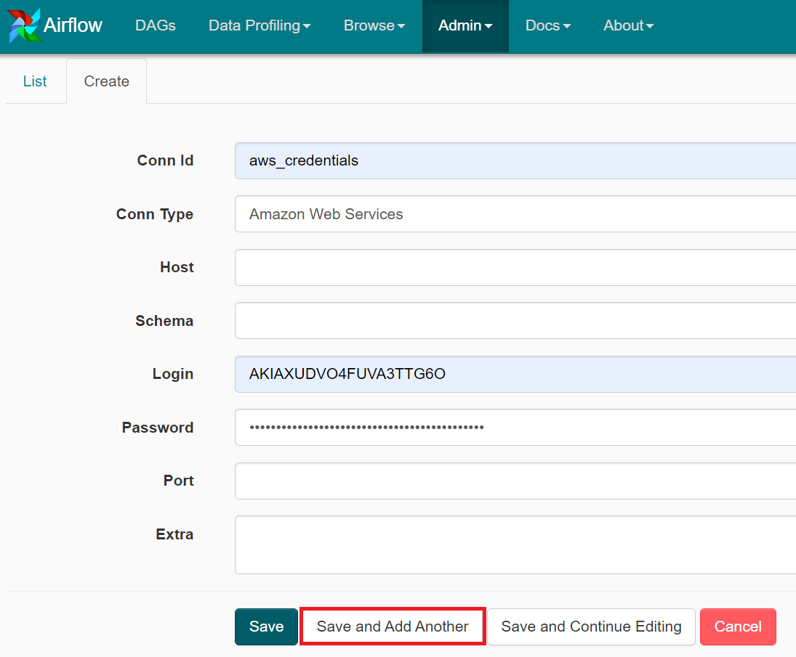
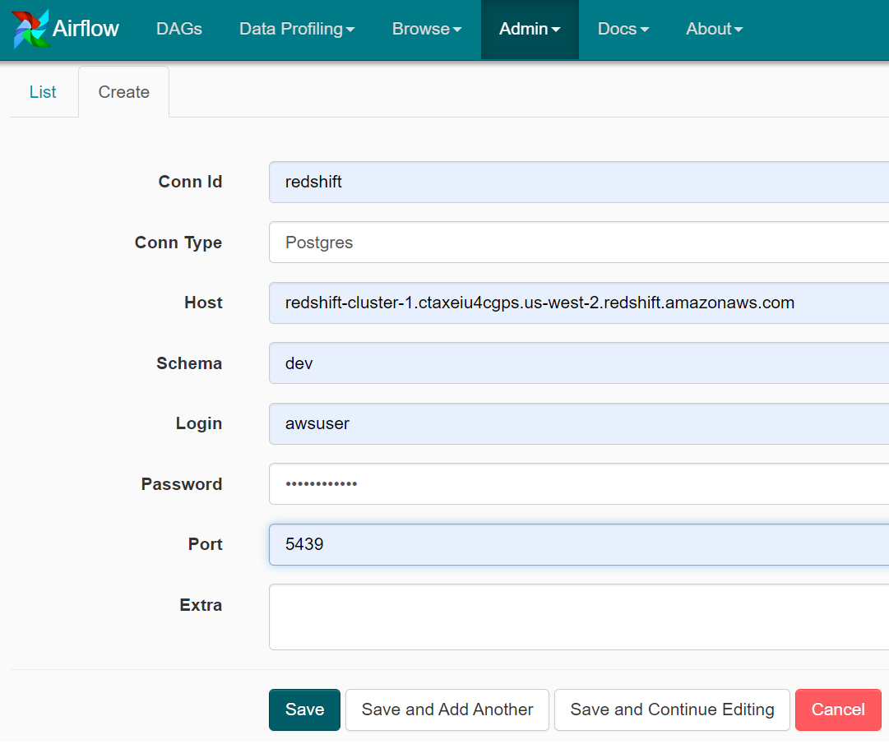

 <h1 align="center">Data Pipelines with Apache Airflow</h1>

 

## Introduction

A music streaming company, Sparkify, decided that to introduce more automation and monitoring to their data warehouse ETL pipelines and come to the conclusion that the best tool to achieve this is Apache Airflow.

The goal is to create high grade data pipelines that are dynamic and built from reusable tasks, can be monitored, and allow easy backfills. Tests need to run against their datasets after the ETL steps have been executed to catch any discrepancies in the datasets.

The source data resides in S3 and needs to be processed in Sparkify's data warehouse in Amazon Redshift. The source datasets consist of JSON logs that tell about user activity in the application and JSON metadata about the songs the users listen to.

## Data source

For this project, there are two datasets. Here are the s3 links for each:

`s3://udacity-dend/song_data/`

`s3://udacity-dend/log_data/`

## Prerequisites

- AWS Redshift
- AWS S3
- AWS IAM user
- Apache Airflow
- Python
- PostgreSQL

## Project Details

We will need to create our own custom operators to perform tasks such as:
- staging the data: load the data from S3 bucket into staging tables in Redshift before filling the data into our data warehouse.
- filling the data warehouse: filling the data from the staging tables created in the previous step into our data warehouse.
- running checks on the data as the final step to check that our pipeline worked correctly.

## Data Modeling

## Data Pipeline

## Configuring the DAG

In the DAG, add default parameters according to these guidelines

1. The DAG does not have dependencies on past runs
2. Run hourly
3. On failure, the task are retried 3 times
4. Retries happen every 5 minutes
5. Catchup is turned off
6. Do not email on retry

## Files Description

- **udac_example_dag.py** includes all the tasks and task dependencies
- **operators** folder includes 4 user defined operators that will stage the data (`stage_redshift.py`), transform the data, fill the data warehouse (`load_fact.py`, `load_dimension.py`), and run checks on data quality (`data_quality.py`).
- **create_tables.sql** includes all queries that needed to create the tables.
- **helper** class for the SQL transformations

## How to run

1. Create a Redshift cluster on AWS
2. Run the queries in `create_tables.sql` to create our tables
3. Add your AWS and Redshift credentials through Airflow connections
4. Execute the Dag within Airflow

Below is shown how to add the AWS IAM user credentials and AWS Redshift to the Airflow instance, so that the DAG can execute successfully. 

## How to Add Connection

Use Airflow's UI to configure your AWS credentials and connection to Redshift.

1. Click on the Admin tab and select Connections.

2. Under Connections, select Create and enter the following values to add AWS Credencials.
- **Conn Id**: Enter aws_credentials.
- **Conn Type**: Enter Amazon Web Services.
- **Login**: Enter your Access key ID from the IAM User credentials you downloaded earlier.
- **Password**: Enter your Secret access key from the IAM User credentials you downloaded earlier.
Once you've entered these values, select Save and Add Another.

3. On the create connection page, enter the following values:

4. On the next create connection page, enter the following values:

- **Conn Id**: Enter redshift.
- **Conn Type**: Enter Postgres.
- **Host**: Enter the endpoint of your Redshift cluster, excluding the port and schema at the end. You can find this by selecting your cluster in the clusters page of the Amazon Redshift console. See where this is located in the screenshot below. IMPORTANT: Make sure to NOT include the port at the end of the Redshift endpoint string.
- **Schema**: This is the Redshift database you want to connect to (defualt is dev).
- **Login**: Enter the user name of the Redshfit cluster (defualt is awsuser).
- **Password**: Enter the password you created when launching your Redshift cluster.
- **Port**: Enter port number that existing at the end of the Redshift endpoint.  

Finally hit **Save**. 

Now we added the needed connections and we can run our dag, all we need to do is to turn on the dag and it will run automatically as it runs in a scheduling.
